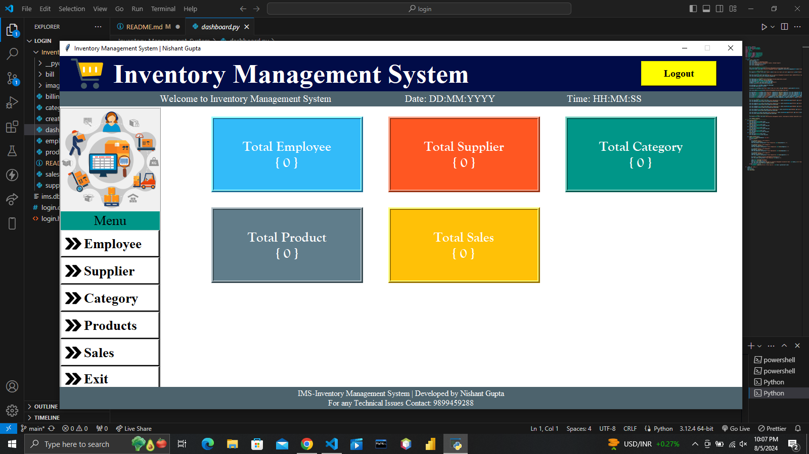
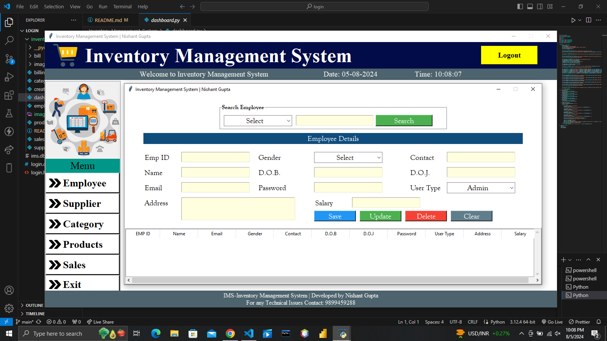
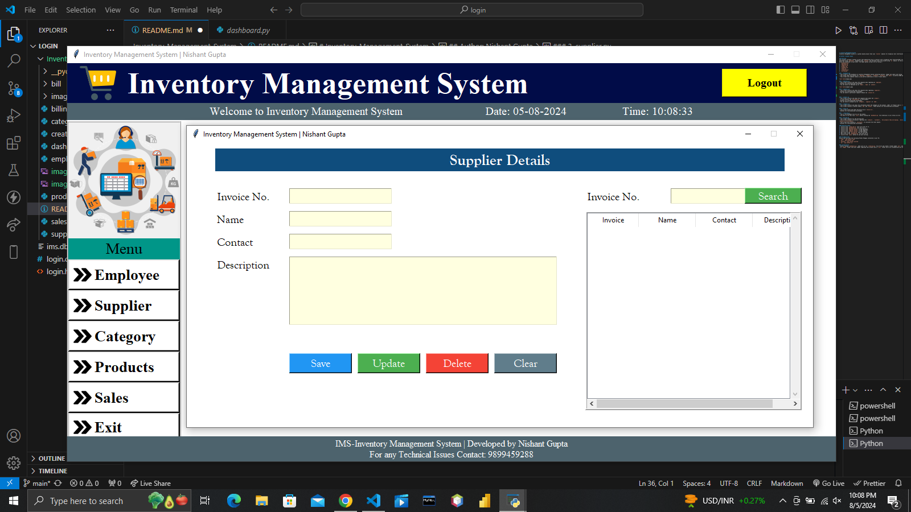
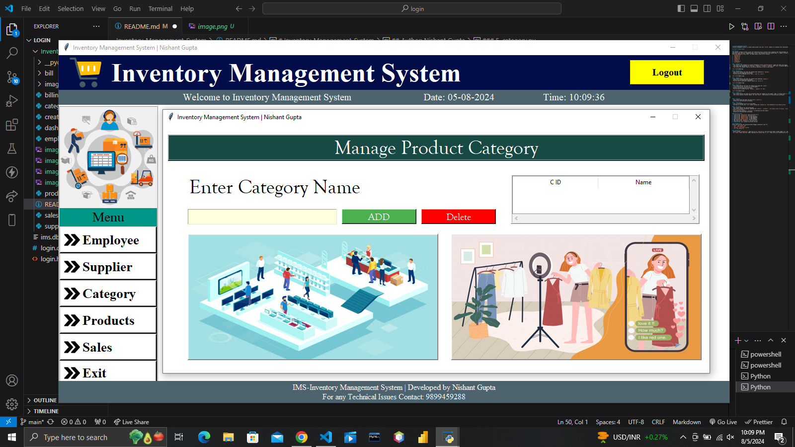
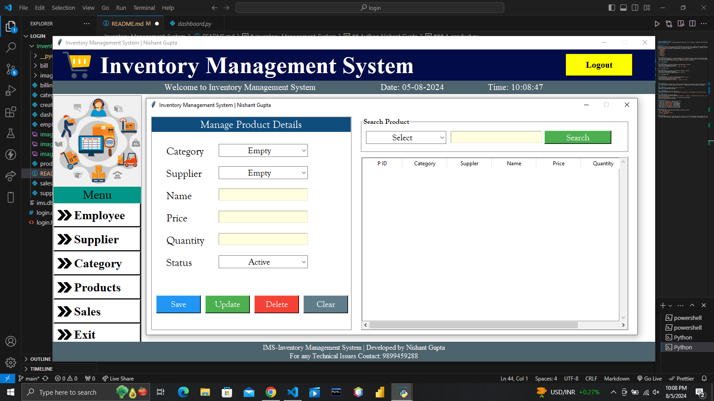
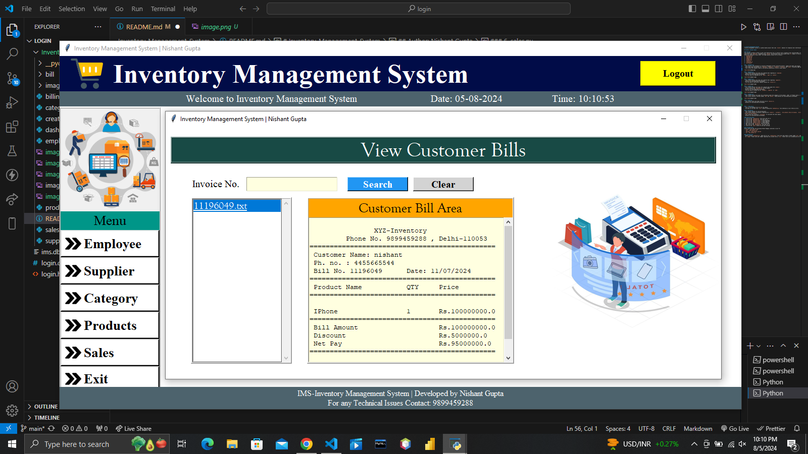
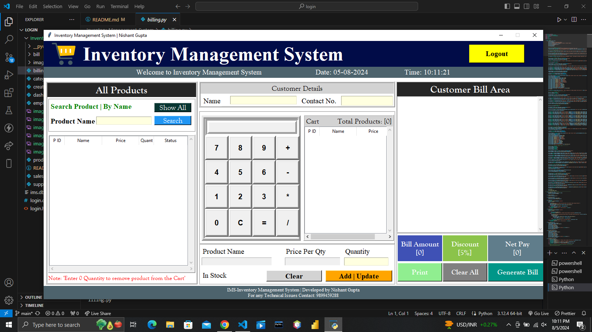

# Inventory Management System

A Python-based desktop Inventory Management System (IMS) built with `tkinter` for the GUI and `sqlite3` for local data storage.

> This project was completed as part of the CT70A3000 Software Maintenance course, Spring 2026. The original codebase was refactored, extended with a new feature, and tested as part of the coursework.

## Overview

The IMS allows a business to manage employees, suppliers, product categories, products, and customer billing through a graphical user interface. The system has been refactored to improve code quality, extended with a Low Stock Alert feature, and covered with a pytest test suite.

### Project Structure
```
Inventory-Management-System/
├── app/
│   ├── dashboard.py       ← entry point
│   ├── employee.py
│   ├── supplier.py
│   ├── category.py
│   ├── product.py
│   ├── sales.py
│   ├── billing.py
│   ├── low_stock.py       ← new feature (T3)
│   ├── create_db.py
│   ├── db_helper.py       ← centralised DB connection (T2)
│   ├── images/
│   └── bill/
└── tests/
    ├── conftest.py
    ├── test_unit.py
    ├── test_integration.py
    └── test_regression.py
```

## Modules

### 1. `dashboard.py`
- Entry point of the application.
- Displays the main window with a navigation menu and stat cards for Employee, Supplier, Category, Product, Sales, and Low Stock counts.
- Stat cards update in real time every 200ms.
- The **Low Stock Items** card turns red when any product stock falls at or below 5 units. *(new - T3)*



### 2. `employee.py`
- This screen collects and shows the complete data regarding 
  an `employee`.
- Buttons are functionalised accordingly.
- You can search an employee by its `email`, `name` or `contact`.



### 3. `supplier.py`
- This screen collects and shows the complete data regarding 
  `suppliers`.
- Buttons are functionalised accordingly.
- You can search a particular supplier by `invoice no`.



### 4. `category.py`
- This screen collects and shows the complete data about 
  the `product`.
- It also ensures the `availability` of the product.
- Buttons are functionalised accordingly.
- You can search a product by its `category`, `supplier` 
  or `name`.



### 5. `product.py`
- This screen collects and shows the information about the category of the product. For example, if the product name is `iPhone` then its category is `Phone`.
- This screen contains 2 buttons namely `Add` and `Delete`. 
  These buttons are functionalised accordingly.



### 6. `sales.py`
- This screen stores and shows the bills by `invoice no`.
- Buttons are functionalised accordingly.



### 7. `billing.py`
- This screen contains the complete billing workflow.
- Contains information regarding `products`, `customers`, `the products they are buying`, `billing structure`, `price of product`, and `discount on the products`.
- Applies a fixed 5% discount automatically.
- Also contains a built-in `calculator` to calculate the total amount.
- Bills are saved as `.txt` files in the `bill/` folder.
- Buttons are functionalised accordingly.



### 8. `create_db.py`
- Creates all required database tables on first run.
- Must be run before `dashboard.py`, otherwise it will throw an error.

### 9. `db_helper.py` *(new - T2)*
- Centralised database connection module.
- Exposes a single `get_db_connection()` function used by all modules.
- Resolves the database path dynamically using `os.path`.

### 10. `low_stock.py` *(new - T3)*
- Dedicated Low Stock Alert window.
- Displays all products with quantity ≤ 5 units in a colour-coded table.
- Red rows = out of stock, orange rows = critically low (1–5 units).
- Accessible from the dashboard menu or by clicking the Low Stock stat card.

## Getting Started

### Prerequisites

Make sure you have Python 3.12+ installed. Then install the required package:
```bash
pip install pillow
```

> Note: `tkinter`, `sqlite3`, `os`, and `time` are all part of the Python standard library — they do not need to be installed separately.

### Setup and Run
```bash
# 1. Clone the repository
git clone https://github.com/thethtarzin111/inventory-management-system.git
cd Inventory-Management-System

# 2. Create and activate virtual environment
python -m venv venv
venv\Scripts\activate      # Windows
source venv/bin/activate   # Mac/Linux

# 3. Install dependencies
pip install pillow

# 4. Navigate to app folder and initialise the database
cd app
python create_db.py

# 5. Run the application
python dashboard.py
```

## Running Tests
```bash
# From the project root
pip install pytest
pytest tests/ -v
```

All 14 tests should pass.

## What Was Changed (Course Tasks)

| Task | Description |
|------|-------------|
| T1 | Code comprehension - class diagram, sequence diagram, dependency graph, architecture description |
| T2 | Refactoring - centralised DB connection, fixed SQL injection, fixed unclosed connections, fixed logic bug in product validation, renamed variables to proper types |
| T3 | New feature - Low Stock Alert system (dashboard integration + dedicated window) |
| T4 | Test suite - 8 unit tests, 2 integration tests, 4 regression tests using pytest |

## Dependencies

| Package | Purpose | Install |
|---------|---------|---------|
| `Pillow` | Image rendering | `pip install pillow` |
| `tkinter` | GUI framework | Built-in |
| `sqlite3` | Database | Built-in |
| `pytest` | Testing | `pip install pytest` |
| `os`, `time` | System utilities | Built-in |
